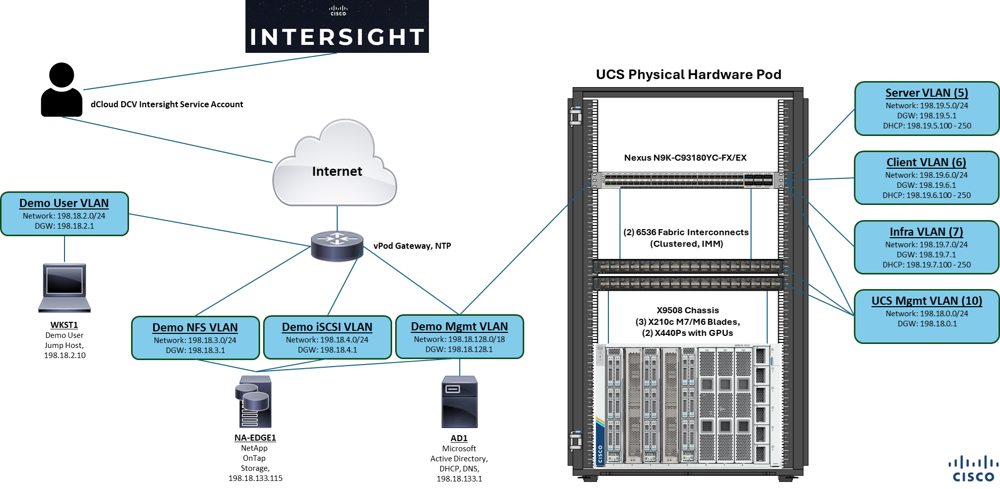

<h1 align="center">Making Commercials with LTX AI Video Guide</h1>

<br>
<p align="center">
  
</p>  
<br>
<p align="center">
  The Making Commercials with LTX AI Video Guide automates the installation of the software needed for a local private AI video model setup using LTX-2 for making video commercials, marketing promos and more.

Generative AI video models are rapidly changing how video content is created and used. Their benefits span creative, business, and technical areas, enabling the following:
  - **Faster Content Creation and Cost Reduction** – Traditional video production can take days or weeks. AI video models can create scenes in minutes from text prompts or images, dramatically reducing production time and enabling rapid prototyping for ideas, ads, or storyboards. Video models also lower or eliminate the costs of expensive video production equipment, editing, etc. Small teams (or even individuals) can produce high-quality videos, reducing reliance on studios, sets, and post-production workflows.
  - **Creative Flexibility** – Video models let creators generate visuals that would be difficult, dangerous, or impossible to film. Fantasy, sci-fi, or historical scenes can be created without physical constraints with easy iteration by tweaking prompts to explore different styles, angles, or moods. Artistic styles can also be blended (e.g., animation + realism).
  - **Rapid Experimentation** for Better Market Performance – Marketing teams can A/B test video ads at scale to test and optimize multiple concepts quickly, filmmakers can visualize scenes before shooting and game designers can prototype cutscenes or environments.
  - **Personalization at Scale** – AI generated video enables customized content for different audiences. Personalized ads or educational content with language localization (voice, text, even lip-sync adjustments) is now as simple as changing the prompt. Dynamic content can be created based on user preferences.
  - **Accessibility & Democratization** – More people can create video content, even without technical skills. Video models enable a lower barrier to entry for creators and small businesses and allowing new voices and ideas to emerge.
Local AI video models enable these many benefits without the burden of ongoing token and subscription costs. 
</p>
<br>

## AI Models
- [Lightricks LTX-2](https://huggingface.co/Lightricks/LTX-2) - Video Model, Full (FP8) and Distilled

## AI Tools
- [ComfyUI](https://www.comfy.org/) via Docker Container

## Default System Requirements
- Ubuntu 22.04.x Linux Operating System on bare-metal or WSL (Windows Subsystem for Linux).
- NVIDIA GPU supported by CUDA 13 or greater. The setup was tested on an NVIDIA L40S GPU with 48 GB of VRAM and an NVIDIA RTX 4090 with 24 GB of VRAM.
- About 115 GB of storage space.

## How To Use
1. Please ensure that the above [**Default System Requirements**](https://github.com/ugo-emekauwa/making-commercials-with-ltx-ai-video-guide#default-system-requirements) have been met.
2. Git clone or download the **Making Commercials with LTX AI Video Guide** repository:
  ```
  git clone https://github.com/ugo-emekauwa/making-commercials-with-ltx-ai-video-guide
  ```
3. Change directories to the making-commercials-with-ltx-ai-video-guide folder.
  ```
  cd making-commercials-with-ltx-ai-video-guide
  ```
4. Run the quick-pre-setup script to install all of the software packages and drivers needed to run the AI models. **`WARNING:`** A server reboot is performed at the end of the script, so please save any work before starting.
  ```
  chmod +x quick-pre-setup.sh
  ./quick-pre-setup.sh
  ```
5. Run the video AI model setup deployment script.
  - **Video AI Model Setup**: This script sets up an environment with the AI video generation model LTX-2 from Lightricks, in full (FP8) and distilled formats. ComfyUI serves as a frontend user-friendly GUI interface for interacting with the AI video and image generation models.
  ```
  ./video-model-setup.sh
  ```

## Using Text to Video to Create Commercials
1. When you first open ComfyUI, you will be presented with the Templates menu. If the Templates menu does not open automatically, click AIl Templates in the left-side menu.
 
2. To begin, we will first work with text to video to create a commercial for a sample company named PseudoCo. Text-to-video involves using a text prompt to generate a video. In the Templates menu, click the option LTX-2 Text to Video.
 
3. The LTX-2 Text to Video template will open a preconfigured workflow template in ComfyUI for creating videos using text prompts. ComfyUI is a node-based visual tool.
 
4. In lower-right corner of the ComfyUI window, click Fit View to automatically zoom on the nodes.
 
5. You can also use the Zoom controls to bring the nodes closer in view. Depending on your mouse interface, the scroll wheel can also be used to zoom and arrange the node view.
 
6. Once the nodes are in view, let’s focus on the Text to Video (LTX 2.0) node, which has a text box pre-filled with a sample prompt.
 
7. Clear the pre-filled text from the Text to Video (LTX 2.0) node, so that it is empty.
 
8. Enter the following prompt in the shaded area into the textbox (the prompt might continue on the next page of this guide). Do not add any additional spaces or extra characters, as the prompts can be very sensitive.

  ``` 
**Duration:** 10s
**Style:** high-energy, intense, bold, fast-cut tech ad

---

**Scene 1 (0–1.5s):**
Immediate action—no fade in. A silver UFO *rockets across frame at extreme speed*, creating a shockwave distortion in space.

---

**Scene 2 (1.5–5s):**
Rapid, high-intensity cuts:

* UFO makes a sharp, almost impossible 90-degree pivot around a massive planet
* Dodges a dense asteroid field at the last second
* Splits through a glowing energy ring, accelerating even faster

Movements feel urgent and reactive—barely in control, but always succeeding.

---

**Scene 3 (5–8s):**
The UFO suddenly brakes hard, drifting slightly before stabilizing—demonstrating control after chaos. It faces camera directly, glowing brighter.

---

**Scene 4 (8–10s):**
The UFO emits a pulse of light outward, briefly illuminating space in a powerful flash. Hold on the glowing craft as energy fades.

---

**Audio:**
Fast-paced, punchy electronic track with heavy beats and risers

**Voiceover (urgent, confident, slightly intense):**
“Markets move fast. If you can’t keep up, you fall behind. Pseudoco helps you pivot instantly and stay in control. Don’t wait.”

**End sound:** sharp digital impact hit

---

**Camera:**
Whip pans, aggressive tracking, quick cuts, slight shake for intensity

**Lighting:**
High contrast, bright flares, intense glow effects, sharp highlights

  ```

10. After entering the text prompt, in the Text to Video (LTX 2.0) node, click the frame_count field and change the value to 241. This will set your video to 10 seconds in length. Leave the other values at the defaults.
 
 
11. In the upper-right corner of the ComfyUI window, click Run.
 
12. This will begin the video generation process. The process will take about 2 minutes and 30 seconds. You can click View job history to view the status.
 
13. Once the job is completed, the video with audio will be available in the Save Video node.
 
14. Click the play button in the Save Video node to view the commercial for PseudoCo.
 
15. This initial video is a high-energy, fast-paced commercial with the theme of PseudoCo helping customers adapt in quickly changing business markets. However, the tone can easily be changed for different customers via the text prompt. We will create another commercial with a smoother and calmer tone.
16. Go to the Text to Video (LTX 2.0) node again, and clear the textbox so that it is empty.
 
17. Enter the following new prompt in the shaded area into the textbox. Do not add any additional spaces or extra characters, as the prompts can be very sensitive.
 
  ```
**Duration:** 10s
**Style:** cinematic, minimalist, high-end tech ad with subtle energy and momentum

---

**Scene 1 (0–2.5s):**
Wide shot of deep space. Calm, minimal, and quiet. A sleek silver UFO slowly enters frame, gliding with perfect control. Subtle reflections from distant planets play across its surface.

---

**Scene 2 (2.5–5s):**
The UFO begins to accelerate smoothly. It curves around a large glowing planet in one continuous, fluid motion—no abrupt cuts. Movement feels intelligent and precise.

---

**Scene 3 (5–7.5s):**
A shift in tempo: the UFO performs a sharp but controlled pivot, then accelerates more decisively forward. A faint energy trail appears—introducing a sense of power and urgency without chaos.

---

**Scene 4 (7.5–10s):**
The UFO approaches camera and comes to a smooth, confident stop. Its lights pulse once, emitting a refined glow that subtly expands outward, then settles. Hold cleanly on the craft.

---

**Audio:**
Modern ambient-electronic track that starts minimal and builds slightly in intensity

**Voiceover (calm, confident, with quiet authority):**
“In a fast-moving market, the ability to adapt is everything. Pseudoco helps you move with clarity, speed, and control. Ready when you are.”

**End sound:** soft but distinct digital tone (clean sonic signature)

---

**Camera:**
Slow cinematic tracking → gentle acceleration → controlled push-in at the end

**Lighting:**
Soft, premium highlights with subtle glow accents; slightly brighter and more energetic in the final moments

  ```

18. In the upper-right corner of the ComfyUI window, click Run again.
 
19. This will begin the video generation process. The process will be slightly shorter since the video model is already loaded in memory. You can click View job history to view the status.
 
20. Once the job is completed, the new video with audio will be available in the Save Video node.
 
21. Click Play in the Save Video node to view the new commercial for PseudoCo with a smoother and calmer tone.
 
This demonstrates how commercials and promos can be easily modified and experimented with based on customer needs with little cost. Let’s now explore how to use an image to make a promo.


## Using Image to Video to Make Marketing Promos
1. In the upper left corner of the ComfyUI window, close the text to image workflow tab named video_ltx2_t2v. If asked to save any changes, you can click No.
 
2. We will now make a short promo for the Cisco dCloud demo service using image-to-video. Image-to-video enables a base image as a reference for a generated video. Click Templates in the left-side menu.
 
3. The Templates menu opens.
 
4. In the Templates menu, click LTX-2 Image to Video (Distilled). Be sure to choose the distilled option, as it is faster and uses less resources than the full version used earlier in the text-to-video examples. The image-to-video generations can be memory intensive.
 
5. The LTX-2 Image to Video (Distilled) workflow tab opens.
 
6. In lower-right corner of the ComfyUI window, click Fit View to automatically zoom on the nodes.
 
7. You can also use the Zoom controls to bring the nodes closer in view. Depending on your mouse interface, the scroll wheel can also be used to zoom and arrange the node view.
 
8. Once the nodes are in view, let’s focus on the Load Image node, which comes pre-filled with a sample image.

9. Open another web browser tab or window and go to https://github.com/ugo-emekauwa/making-commercials-with-ltx-ai-video-guide/blob/main/sample_prompt_material/dCloud-The-Way-Promo.png. You will see an image named ***dCloud-The-Way-Promo.png*** of a father and son pair of tigers. This image was generated on local AI using an open source FLUX image model, which will be explored later in the image generation scenario of this demo guide.

10. Download the image named ***dCloud-The-Way-Promo.png*** to a folder on your machine.
 
11. Go back to ComfyUI. In the Load Image node, click choose file to upload.
 
12. A file explorer window opens. Navigate to the folder location where you downloaded the image named ***dCloud-The-Way-Promo.png***, select it and click Open.
 
13. The image of the two tigers will be opened in the Load Image node.
 
14. Let’s now focus on the Text to Video (LTX 2.0) Distilled node, which has a text box pre-filled with a sample prompt.
 
15. Clear the pre-filled text from the Text to Video (LTX 2.0) Distilled node, so that it is empty.
 
16. Enter the following prompt in the shaded area into the textbox. Do not add any additional spaces or extra characters, as the prompts can be very sensitive.

 ```
a 3-d animated movie scene shows the little tiger turn to the wise elderly tiger on the left and ask: "what is the best way to perform Cisco demos?". with a deep booming voice, the elderly tiger turns to the little tiger and says: “dee-cloud is the way son”. the camera remains static in place
 ```

17. In the upper-right corner of the ComfyUI window, click Run.
 
18. This will begin the video generation process. The process will take about 1 minute. You can click View job history to view the status.
 
19. Once the job is completed, the new video will be available in the Save Video node. You may need to use the Fit View or Zoom controls to bring the Save Video node fully into view.
 
20. Click Play in the Save Video node to view the short promo for Cisco dCloud.
 
This demonstrates how easily commercials and marketing promos can be created using local AI video models.

###### 

## Demonstrations and Learning Labs
Making Commercials with LTX AI Video Guide is used in AI, Cisco UCS, and Intersight demonstrations and labs on Cisco dCloud:

- [Run Gen AI and LLMs on Cisco UCS X-Series with NVIDIA GPUs](https://dcloud2.cisco.com/demo/run-gen-ai-and-llms-on-cisco-ucs-x-series)
<br><br>


<br><br>

dCloud is available at [https://dcloud.cisco.com](https://dcloud.cisco.com), where Cisco product demonstrations and labs can be found in the Catalog.

## Author
Ugo Emekauwa

## Contact Information
uemekauw@cisco.com or uemekauwa@gmail.com
